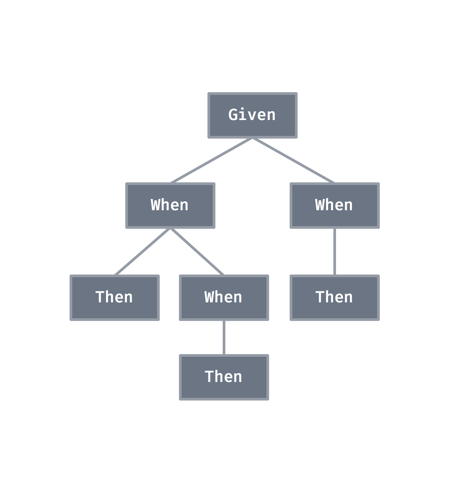
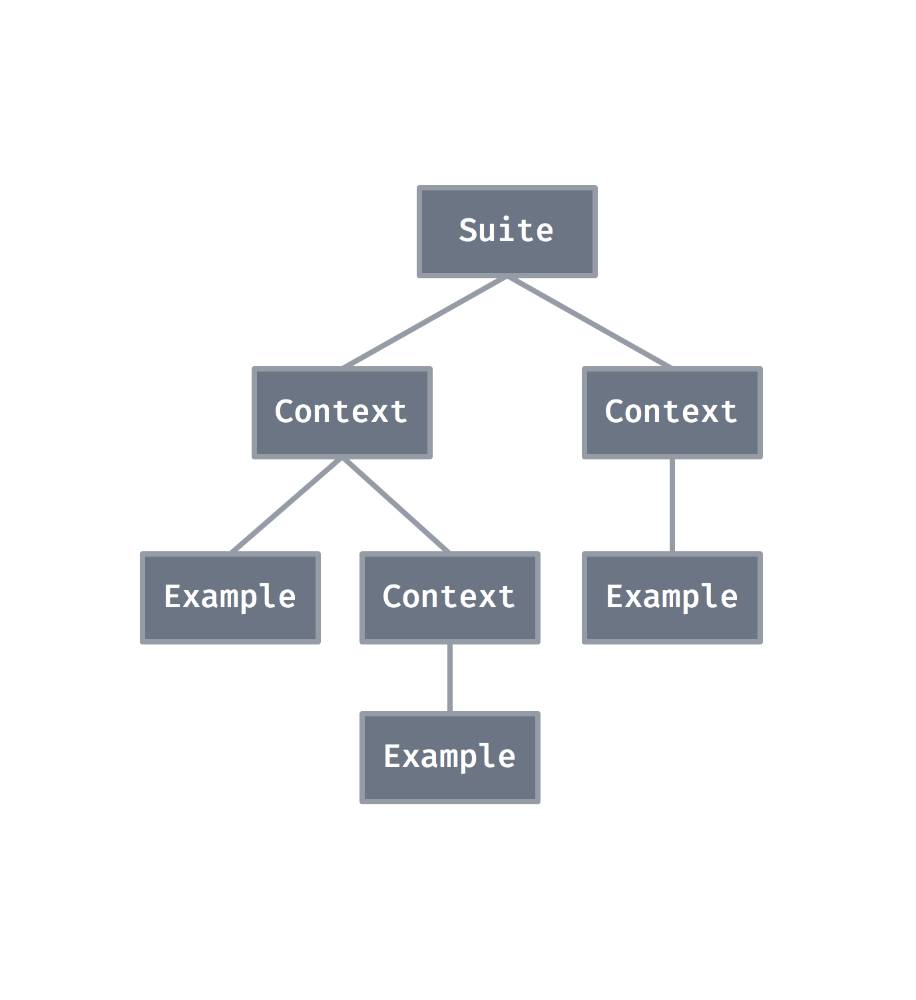
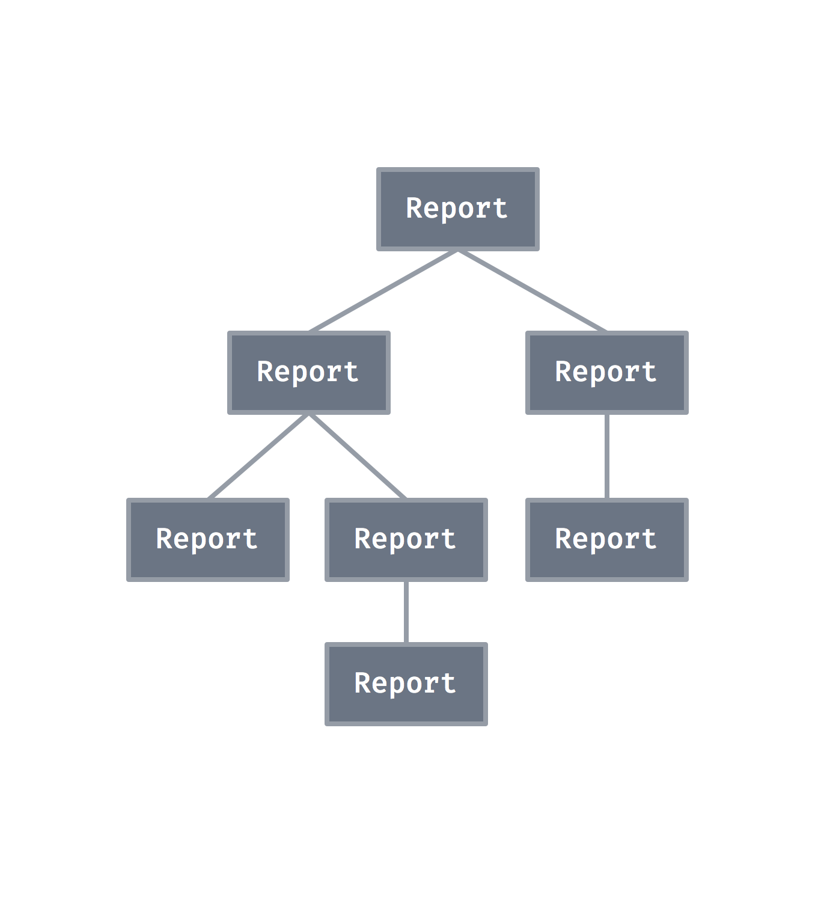

footer: Vincent Esche, Making a BDD test framework in stable Rust
slidenumbers: true
autoscale: false
theme: Fira, 0

# rspec

#### Making a BDD test framework in stable Rust

^ Thomas Wickham (@mackwic)

---

# Unit Testing

Unit testing allows the programmer to **refactor code** or **upgrade dependencies** at a later date, and make sure the module **still works correctly**.

The procedure is to **write test cases** for **all functions** and **methods** so that whenever a change causes a **fault**, it can be **quickly identified**.[^1]

[^1]: https://en.wikipedia.org/wiki/Unit_testing

---

# Inline Tests

```rust

struct Foo { count: usize }

impl Foo {
  fn increment(&mut self) { self.count += 1; }
  
  #[test]
  fn it_works() { /* ... */ }
}
```

---

# Test Modules

```rust

struct Foo { count: usize }

impl Foo {
  fn increment(&mut self) { self.count += 1; }
}

#[cfg(test)]
mod tests {
  #[test]
  fn it_works() { /* ... */ }
}
```

---

# Classic Testing

```rust
#[test]
fn adding_existing_item_to_set() {
  let mut set: BTreeSet<_> = ["existing"].iter().cloned().collect();
  let size_before = set.len();
  set.insert("nonexisting");
  assert_eq!(set.len(), size_before);
}

#[test]
fn adding_nonexisting_item_to_set() {
  let mut set: BTreeSet<_> = ["existing"].iter().cloned().collect();
  let size_before = set.len();
  set.insert("existing");
  assert_eq!(set.len(), size_before + 1);
}
```

---

[.build-lists: true]

# Downsides

- Test names should be for humans.
- No code sharing, due to shallow contexts.
- Missing 'fn setup/teardown()'.
- Missing test fixtures.
- Structure-less bag of tests.

---

[.build-lists: true]

# Let's fix it!

- Names are strings. For humans.
- Code sharing, through nested contexts.
- Finely grained 'fn before/after()'.
- Test fixtures ('environments').
- Structured hierarchy of tests.

---

# Gherkin language[^2]

```
Scenario: BTreeSet adheres to set semantics
  Given a set of items
  When adding a non-existing item
    Then the set's size grows by 1
```

[^2]: https://github.com/cucumber/cucumber/wiki/Gherkin

---

# Nested Contexts

```
Scenario: BTreeSet adheres to set semantics
  Given a set of items
    When adding a non-existing item
      Then the set's size grows by 1
      When adding it again
        Then the set's size stays the same
```

---

# Shared Contexts

```
Scenario: BTreeSet adheres to set semantics
  Given a set of items
    When adding a non-existing item
      Then the set's size grows by 1
      When adding it again
        Then the set's size stays the same
    When adding an existing item
      Then the set's size stays the same
```

---



# Contexts

```
Scenario: BTreeSet adheres to set semantics
  Given a set of items
    When adding a non-existing item
      Then the set's size grows by 1
      When adding it again
        Then the set's size stays the same
    When adding an existing item
      Then the set's size stays the same
```

---

# Shiny[^4]

```rust
describe!(
  before_each { let mut subject = true; }
  it "is true" { assert!(subject); }
)
```

[^4]: https://github.com/farcaller/shiny

---

# Stainless[^3]

```rust
describe! stainless {
  before_each { let mut stainless = true; }
  it "is true" { assert!(stainless); }
  after_each { stainless = false; }

  describe! nesting {
    /* ... */
    describe! further_nesting {
      /* ... */
    }
  }
}
```

[^3]: https://github.com/reem/stainless

---

[.build-lists: true]

# Not quite there yet

- Unstable, nightly-only.
- Tests breaking regularly.
- Limited to shallow contexts.
- Still no true code sharing.
- Incomplete feature-set.

---

[.build-lists: true]

# rspec

```rust
rspec::run(&rspec::describe("rspec", Environment::default(), |ctx| {
  ctx.before_each(|env| { env.subject = true; }); // &mut Environment
  
  ctx.it("is true", |env| assert!(env.subject)); // &Environment
  
  ctx.after_each(|env| { env.subject = false; }); // &mut Environment

  ctx.specify("nested contexts", |ctx| {
    /* ... */
    ctx.specify("further nested contexts", |ctx| {
    /* ... */
    });
  });
}));
```

---

# rspec

- Stable by principle.
- Arbitrarily nested tests.
- Fully parallelized execution.
- Guaranteed execution safety.
- Rich & extensible features.

---

# Suites, Contexts & Examples

|           | Variant A  | Variant B  | Variant C  |
|-----------|------------|------------|------------|
| Suites:   | `suite`    | `describe` | `given`    |
| Contexts: | `context`  | `specify`  | `when`     |
| Examples: | `example`  | `it`       | `then`     |

---

# Variant A

```rust
runner.run(&rspec::suite("opens a suite", /* environment */, |ctx| {
  ctx.context("opens a context", |ctx| {
    ctx.example("opens an example", |env| /* test condition */ );
  });
}));
```

---

# Variant B

```rust
runner.run(&rspec::describe("opens a suite", /* environment */, |ctx| {
  ctx.specify("opens a context", |ctx| {
    ctx.it("opens an example", |env| /* test condition */ );
  });
}));
```

---

# Variant C

```rust
runner.run(&rspec::given("opens a suite", /* environment */, |ctx| {
  ctx.when("opens a context", |ctx| {
    ctx.then("opens an example", |env| /* test condition */ );
  });
}));
```

---

# Before & After

|     | All           | Each      |
|---------|-----------------------|---------------|
| Before: | `before`/`before_all` | `before_each` |
| After:  | `after`/`after_all`   | `after_each`  |

---

# All & Each

**All**: executed **once upon entering** (or exiting, respectively) **the given context**.

**Each**: executed **once before each** of the given context's **sub-contexts or examples**.

---


# Contexts

```
Scenario: BTreeSet adheres to set semantics
  Given a set of items
  When adding a non-existing item
    Then the set's size grows by 1
    When adding it again
    Then the set's size stays the same
  When adding an existing item
    Then the set's size stays the same
```

---


# Contexts

```
rspec::given("a set ...
  ctx.when("adding a ...
    ctx.then("the set's ...
    ctx.when("adding it ...
      ctx.then("the set's ...
    });
  });
  ctx.when("adding an ...
    ctx.then("the set's ...
  });
});
```

---

# Internals

---

# Headers

```rust
pub struct SuiteHeader {
  pub label: SuiteLabel,
  pub name: &'static str,
}
pub struct ContextHeader {
  pub label: ContextLabel,
  pub name: &'static str,
}
pub struct ExampleHeader {
  pub label: ExampleLabel,
  pub name: &'static str,
}
```

---

# Labels

```rust
pub enum SuiteLabel {
  Suite, Describe, Given
}
pub enum ContextLabel {
  Context, Specify, When
}
pub enum ExampleLabel {
  Example, It, Then
}
```

---

# Suite

```rust
pub struct Suite<T> {
    pub(crate) header: SuiteHeader,
    pub(crate) environment: T,
    pub(crate) context: Context<T>,
}
```

---

# Context

```rust
pub struct Context<T> {
    pub(crate) header: Option<ContextHeader>,
    pub(crate) blocks: Vec<Block<T>>,
    pub(crate) before_all: Vec<Box<Fn(&mut T)>>,
    pub(crate) before_each: Vec<Box<Fn(&mut T)>>,
    pub(crate) after_all: Vec<Box<Fn(&mut T)>>,
    pub(crate) after_each: Vec<Box<Fn(&mut T)>>,
}
```

---

# Block

```rust
pub enum Block<T> {
    Context(Context<T>),
    Example(Example<T>),
}
```

---

# Example

```rust
pub struct Example<T> {
    pub(crate) header: ExampleHeader,
    pub(crate) function: Box<Fn(&T) -> ExampleReport>,
}
```

---

# Reports

```rust
pub struct SuiteReport {
    header: SuiteHeader,
    context: ContextReport,
}
pub struct ContextReport {
    sub_reports: Vec<BlockReport>,
}
pub enum BlockReport {
    Context(Option<ContextHeader>, context::ContextReport),
    Example(ExampleHeader, example::ExampleReport),
}
pub enum ExampleReport {
    Success,
    Failure(Option<String>),
    Ignored,
}
```

---




---

# Runner

```rust
let logger = Arc::new(Logger::new(io::stdout()));
let config = …Builder::default().build().unwrap();
let runner = Runner::new(
  config,
  vec![logger],
);
```

---

# rspec::run

```rust
pub fn run<T>(suite: &Suite<T>)
where
    T: Clone + Send + Sync + ::std::fmt::Debug,
{
    let logger = Arc::new(Logger::new(io::stdout()));
    let configuration = …Builder::default().build().unwrap();
    let runner = Runner::new(configuration, vec![logger]);
    runner.run(suite);
}
```

---

# RunnerObserver

```rust
pub trait RunnerObserver: Send + Sync {
  fn enter_suite(&self, &Runner, &SuiteHeader) {}
  fn exit_suite(&self, &Runner, &SuiteHeader, &SuiteReport) {}
  fn enter_context(&self, &Runner, &ContextHeader) {}
  fn exit_context(&self, &Runner, &ContextHeader, &ContextReport) {}
  fn enter_example(&self, &Runner, &ExampleHeader) {}
  fn exit_example(&self, &Runner, &ExampleHeader, &ExampleReport) {}
}
```

---

# Logger

```rust
pub struct Logger<T: io::Write> {
    serial: SerialLogger<T>,
}

impl<T: io::Write> RunnerObserver for Logger<T>
where
  T: Send + Sync,
{
  // ...
}
```

---

# Output

```
Given "a BTreeSet"
  When "not having added any items"
    Then "it is empty" ... ok
  When "adding an new item"
    Then "it is not empty any more" ... ok
  When "returning to outer context"
    Then "it is still empty" ... ok
  Then "panic!(…) fails" ... FAILED

failures:

Given "a BTreeSet"
  Then "panic!(…) fails"
    thread panicked at '"Some reason for failure."'.

duration: 0.000s.

test result: FAILED. 5 passed; 1 failed; 0 ignored
```

---

# Serial Execution

```rust
fn evaluate_blocks_parallel<T>(&self, context, environment)
  -> Vec<BlockReport>
  where
    T: Clone + Send + Sync + ::std::fmt::Debug,
  {
    context
      .blocks
      .iter()
      .map(|block| {
        self.evaluate_block(block, context, environment)
      }).collect()
  }
```

---

# Parallel Execution

```rust
fn evaluate_blocks_parallel<T>(&self, context, environment)
  -> Vec<BlockReport>
  where
    T: Clone + Send + Sync + ::std::fmt::Debug,
  {
    context
      .blocks
      .par_iter()
      .map(|block| {
        self.evaluate_block(block, context, environment)
      }).collect()
  }
```

---

# Fearless Concurrency!


---

# Well, almost.

---

```
tests:

Given "a value of zero"
  Then "it is zero" ...     When "multiplying by itself"
      When "adding a value to it"
ok
      Then "it remains zero" ...         Then "it becomes said value" ... ok
ok

test result: ok. 3 passed; 0 failed; 0 ignored
```

---

## Knock knock.
## Race condition.
## Who's there?

---

# enter_suite & others

```rust
pub struct Logger<T: io::Write> {
    serial: SerialLogger<T>,
}

fn enter_suite(&self, runner: &Runner, header: &SuiteHeader) {
  if runner.configuration.parallel {
    // If the suite is being evaluated in parallel
    // we basically wait for `exit_suite`.
  } else {
    self.serial.enter_suite(runner, header);
  }
}
```

---

# exit_suite

```rust
fn exit_suite(&self,
  runner: &Runner, header: &SuiteHeader, report: &SuiteReport
) {
  if runner.configuration.parallel {
    // If the suite is being evaluated in parallel
    // and we have reached the end of it, then it is time to
    // forward a replay of the events to the inner serial logger:
    self.replay_suite(runner, header, report);
  } else {
    self.serial.exit_suite(runner, header, report);
  }
}
```

---


```rust
fn replay_suite(&self, runner, suite, report) {
  self.serial.enter_suite(runner, suite);
  self.replay_context(runner, ...);
  self.serial.exit_suite(runner, suite, report);
}

fn replay_context(&self, runner, context, report) {
  self.serial.enter_context(runner, header);
  for report in report.get_blocks() {
    self.replay_block(runner, report);
  }
  self.serial.exit_context(runner, header, report);
}

fn replay_block(&self, runner, report) {
  // ...
}

fn replay_example(&self, runner, example, report) {
  self.serial.enter_example(runner, example);
  self.serial.exit_example(runner, example, report);
}
```

---

# Matching

- `Result<T, E>` -> (success | failure)
- `bool` -> (success | failure)
- `()` -> success
- `panic!()` -> failure

---

# Integration

In addition to recognizing several **stdlib types** the use of **expectest[^5] matchers** is also **supported**:

Just run **rspec** with `--features 'expectest_compat'`.

[^5]: https://github.com/zummenix/expectest/pull/34

---

# Roadmap[^6]

- Timing & Progress Bars
- Priorization, Filtering & Focussing
- Async tests
- Macro-based DSL?
- Test Harnish RFC?[^7]

[^6]: https://github.com/rust-rspec/rspec/issues/29
[^7]: https://internals.rust-lang.org/t/test-and-external-test-harnesses/3145/10

---

# Contribute![^8]

[^8]: https://github.com/rust-rspec/rspec#contributions

---

# Thanks! Questions?